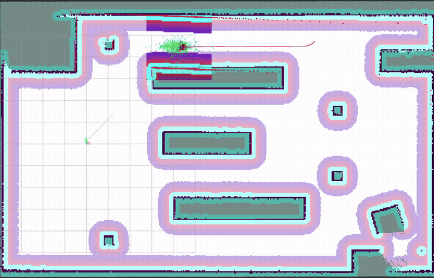
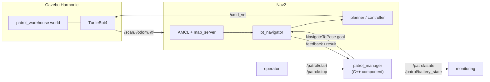
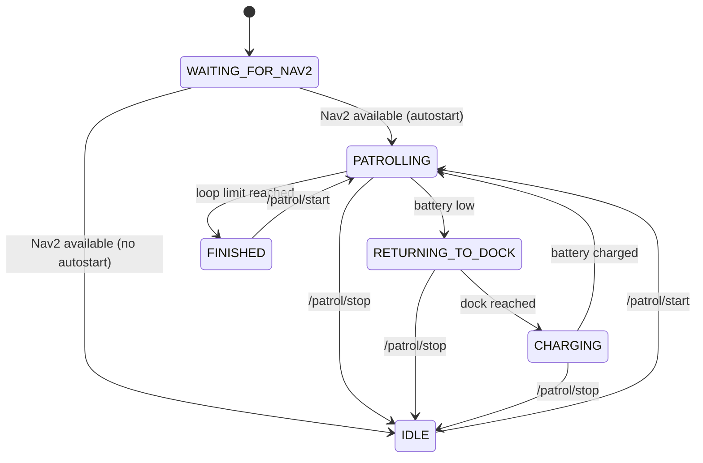

# ROS 2 Autonomous Patrol Robot

[](https://github.com/adriaangm/ros2-autonomous-patrol/actions/workflows/ci.yml)


Autonomous security/inspection patrol for a TurtleBot4 in a simulated industrial warehouse.
A C++ mission layer drives **Nav2** through a configurable waypoint route, recovers from
navigation failures and returns to its charging dock when the (simulated) battery runs low.



## Features

- **Custom warehouse world** (Gazebo Harmonic, SDF + xacro macros) with racks, pillars,
  loading dock and charging station.
- **Map built with SLAM Toolbox** and localization with AMCL — the map frame is aligned with
  the world frame, so waypoints can be read directly from Gazebo.
- **Patrol manager in C++** (`rclcpp` composable component):
  - waypoint route loaded from YAML (`[x, y, yaw]` per named waypoint);
  - Nav2 `NavigateToPose` action client with retries and skip-on-failure;
  - simulated battery: returns to dock when low, charges, and resumes the patrol
    at the interrupted waypoint;
  - `/patrol/start` and `/patrol/stop` services, state and battery topics.
- **Unit tests** (gtest) and **CI** on every push (GitHub Actions, `ros:jazzy` container).

## Architecture



The mission layer decides **where** the robot goes; Nav2 decides **how** to get there.

### Mission state machine



## Repository structure

```
ros2-autonomous-patrol/
├── patrol_bringup/          # Launch files, Nav2 config, map and world
│   ├── config/              # nav2_params.yaml, patrol_mission.yaml
│   ├── launch/              # simulation.launch.py, patrol_mission.launch.py
│   ├── maps/                # patrol_warehouse.{pgm,yaml} (SLAM Toolbox)
│   └── worlds/              # patrol_warehouse.sdf.xacro
├── patrol_mission/          # C++ mission manager
│   ├── include/patrol_mission/
│   ├── src/patrol_manager.cpp
│   └── test/test_battery_model.cpp
└── .github/workflows/ci.yml
```

## Getting started

### Requirements

- Ubuntu 24.04 (native or WSL2 with GPU acceleration)
- ROS 2 Jazzy (`ros-jazzy-desktop`)

### Build

```bash
mkdir -p ~/ros2_ws/src && cd ~/ros2_ws/src
git clone https://github.com/adriaangm/ros2-autonomous-patrol.git
cd ~/ros2_ws
rosdep install --from-paths src --ignore-src -r -y
colcon build --symlink-install
source install/setup.bash
```

### Run the patrol

```bash
# Terminal 1: simulation + Nav2 (add headless:=False to open the Gazebo GUI)
ros2 launch patrol_bringup simulation.launch.py headless:=True

# Terminal 2: mission manager (waits for Nav2, then starts patrolling)
ros2 launch patrol_bringup patrol_mission.launch.py
```

### Interact with the mission

```bash
ros2 topic echo /patrol/state
ros2 topic echo /patrol/battery_state --field percentage
ros2 service call /patrol/stop  std_srvs/srv/Trigger
ros2 service call /patrol/start std_srvs/srv/Trigger
```

### Build a new map

```bash
ros2 launch patrol_bringup simulation.launch.py slam:=True headless:=True
ros2 run teleop_twist_keyboard teleop_twist_keyboard
ros2 run nav2_map_server map_saver_cli -f src/ros2-autonomous-patrol/patrol_bringup/maps/patrol_warehouse
```

## Configuration

The route and battery model are defined in
[`patrol_bringup/config/patrol_mission.yaml`](patrol_bringup/config/patrol_mission.yaml):

```yaml
waypoint_names: [north_west, north_east, loading_dock, south_east, south_west, central_aisle]
waypoints:
  north_west:   [2.5, 4.7, 0.0]      # [x, y, yaw] in the map frame
  loading_dock: [13.0, 0.5, -1.5708]
dock_pose: [-2.8, 0.0, 3.1416]
battery:
  drain_rate_moving: 1.0             # %/s
  low_threshold: 30.0                # %
```

| Parameter | Default | Description |
|---|---|---|
| `autostart` | `true` | Start patrolling as soon as Nav2 is available |
| `loop_patrol` / `max_loops` | `true` / `0` | Repeat the route (`0` = forever) |
| `max_retries` / `retry_delay` | `2` / `3.0 s` | Retries per waypoint before skipping it |
| `battery.*` | see YAML | Drain/charge rates and return/resume thresholds |

## ROS interfaces

| Name | Type | Description |
|---|---|---|
| `navigate_to_pose` | `nav2_msgs/action/NavigateToPose` (client) | Goals sent to Nav2 |
| `/patrol/state` | `std_msgs/msg/String` (transient local) | Current mission state |
| `/patrol/battery_state` | `sensor_msgs/msg/BatteryState` | Simulated battery |
| `/patrol/start` | `std_srvs/srv/Trigger` | Start / resume the patrol |
| `/patrol/stop` | `std_srvs/srv/Trigger` | Stop the patrol and cancel the active goal |

## Design notes

- **Non-blocking action client.** The state machine advances on a 10 Hz timer; action callbacks
  only record outcomes. Nothing blocks the executor (no `spin_until_future_complete` in callbacks).
- **Stale-result protection.** Every goal carries a sequence number; results from preempted
  goals (e.g. interrupted by low battery) are ignored without locks.
- **Simulation time.** All timing uses the node clock, so the battery follows the simulator
  even when it runs slower than real time.
- **Fail fast on bad configuration.** Malformed waypoints or inconsistent battery thresholds
  abort startup with a clear error instead of misbehaving mid-mission.
- **Testable core.** The battery model is ROS-agnostic and covered by unit tests.

## Testing

```bash
colcon test --packages-select patrol_mission
colcon test-result --verbose
```

## Roadmap

- [ ] Docker image to run the full demo without a local ROS installation
- [ ] Integration test with `launch_testing` (mission reaches every waypoint)
- [ ] Mission logic as a BehaviorTree.CPP tree
- [ ] Dynamic obstacles (people / forklifts) in the warehouse

## Author

**Adrián García Masip** — MSc Mechatronics student at Universitat Politècnica de València
(Informática Industrial y Robótica BSc).

## License

Apache 2.0 — see [LICENSE](LICENSE).